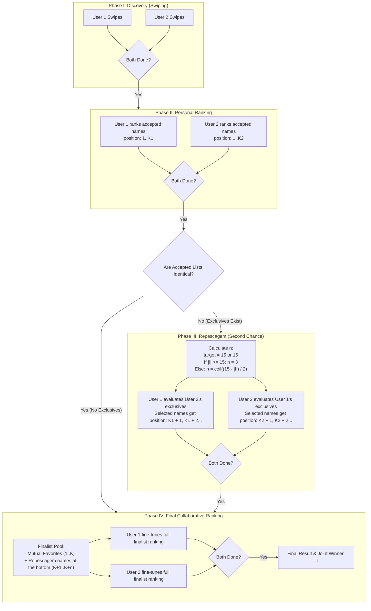

# Baby Names — Architecture & Feature Plan

> This document outlines the roadmap and implementation design for the Baby Names feature enhancements. It covers all requirements, data models, UI flows, migrations, conflict-resolution backfill rules, the Repescagem mechanism, mathematical formulas for phase progression, and test strategies.

---

## 1. Context & Architecture Snapshot

### 1.1 Existing Components
| Component | Current File | Responsibilities |
|---|---|---|
| **Model: Name** | `app/models/baby_name.rb` | Stores candidate names (`name`, `position`, `active`). `position` is used off-app by the couple to group batches (e.g., 1 = starter 20, 2 = Brazilian names, 3 = English names, and future Japanese, Greek, Latin batches). Uniqueness will be enforced via `LOWER(name)` at the DB layer. |
| **Model: Decision & Ranking** | `app/models/baby_name_decision.rb` | Records user choices (`user_id`, `baby_name_id`, `choice: rejected \| accepted \| later`). **Holds `position: integer`** for user-specific rankings across phases. |
| **Controller: Queue** | `app/controllers/baby_names_controller.rb` | Serves next unreviewed name (or oldest `later` decision), computes swipe counts. |
| **Controller: Action** | `app/controllers/baby_name_decisions_controller.rb` | Handles swipe submissions. Postponed (`later`) decisions can be updated to `accepted` or `rejected`. |
| **Phlex View** | `app/views/baby_names/index.rb` | Main card view with swipe gestures, stamps, countdown timer, stats banner. |
| **Layout** | `app/views/layouts/baby_names.rb` | Custom dark, full-screen mobile-optimized layout. |
| **Stimulus Controller** | `app/javascript/controllers/baby_name_swipe_controller.js` | Drag physics, touch/pointer handling, stamp fade, auto-later timer. |
| **Translations** | `config/locales/views/baby_names.yml` | English and Portuguese (`pt-BR`) strings. |

### 1.2 User Personas & Permissions
- **Users**: Gigi (ID 1) and Rikki (ID 4).
- In production, both users have already swiped on names and recorded decisions.
- **Data Safety**: Zero loss of decision history. Existing decisions will be reconciled and preserved.

---

## 2. Requirement-by-Requirement Specification

---

### Requirement 1: Visual Card Adjustments (Remove Story Prompt)
**Current UI**: Inside the card article, below the name, there is a gold divider line (`h-px w-12 bg-amber-400`) followed by the text:
> *"Could this be the name at the start of every story?"* (`baby_names.card.story`)

**Specification**:
1. Remove the text element (`p(class: "mt-5 max-w-64 text-sm leading-relaxed text-slate-500") { I18n.t("baby_names.card.story") }`).
2. Remove the ornamental line above it (`div(class: "mt-5 h-px w-12 bg-amber-400")`).
3. Clean up the `card.story` locale key from `config/locales/views/baby_names.yml` (both `en` and `pt-BR`).

---

### Requirement 2: Route Restriction (Users 1 and 4 Only)
**Objective**: Only Gigi (User ID 1) and Rikki (User ID 4) should have access to `/baby_names` and any associated endpoints.

**Specification**:
1. Introduce an authorization concern or controller guard:
   ```ruby
   ALLOWED_USER_IDS = [1, 4].freeze
   ```
2. Apply `before_action :authenticate_user!` followed by `before_action :ensure_authorized_baby_name_user!`.
3. If an authenticated user's ID is not in `ALLOWED_USER_IDS`:
   - Non-matching users are redirected to `root_path` with an alert (`status: :see_other`), or rendered a `403 Forbidden` error.
4. Protect all related routes:
   - `GET /baby_names`
   - `POST /baby_names/:baby_name_id/decision`
   - `GET /baby_names/review`
   - `GET /baby_names/rank`
   - `POST /baby_names/rank`

---

### Requirement 3: Remove "Gigi & Rikki" Header Text
**Current UI**: In the top navigation header above the question *"What will we call you?"*, there is a small uppercase tracker line:
```ruby
p(class: "text-xs font-semibold uppercase tracking-[0.28em] text-blue-200") { I18n.t("baby_names.couple") }
```
**Specification**:
1. Delete this `p` tag in `app/views/baby_names/index.rb`.
2. Keep the main question `h1` (`"What will we call you?"` / `"Como vamos chamar você?"`).
3. Remove unused `baby_names.couple` keys from `baby_names.yml`.

---

### Requirement 4: Capitalization Normalization & Conflict Resolution Backfill

#### 4.1 Problem
PostgreSQL's existing index is `CREATE UNIQUE INDEX index_baby_names_on_name ON baby_names (name)`. Because the index is case-sensitive at the database layer, `"Nicholas"` and `"NICHOLAS"` can coexist.

#### 4.2 Capitalization Rule
All names must be formatted in Title Case:
```ruby
def self.canonical_name(name)
  name.to_s.strip.split(/\s+/).map(&:capitalize).join(" ")
end
```
Model-level callback in `BabyName`:
```ruby
before_validation :normalize_capitalization

def normalize_capitalization
  self.name = self.class.canonical_name(name) if name.present?
end
```

#### 4.3 Database Constraint
Replace `index_baby_names_on_name` with a functional unique index:
```ruby
remove_index :baby_names, :name
add_index :baby_names, "LOWER(name)", unique: true, name: "index_baby_names_on_lower_name"
```

#### 4.4 Conflict Resolution & Backfill Algorithm
Before creating the `LOWER(name)` unique index, existing duplicates must be merged and reconciled across all users:

For any group of names where `LOWER(name)` is identical:
1. **Identify Surviving Name**:
   - If any version was accepted by either user, select the record associated with the **earliest accepted decision** (`created_at ASC`).
   - If no version was accepted, select the record with the lowest `id` (`created_at ASC`).
   - Mark this record as `surviving_name` and all others in the group as `excess_names`.
   - Update `surviving_name.name = canonical_name(surviving_name.name)`.

2. **Reconcile User Decisions (for each user independently)**:
   - Collect all decisions by this user for `surviving_name.id` and all `excess_names.map(&:id)`.
   - **Case A: User accepted at least one version** (or accepted both):
     - The user's preserved choice is `accepted`.
     - Find the earliest accepted decision record.
     - Point `baby_name_id` to `surviving_name.id`.
     - Delete all other decision records for the duplicate group for this user.
   - **Case B: User rejected all versions**:
     - Keep a single `rejected` decision pointing to `surviving_name.id`.
     - Delete all other decision records for the duplicate group for this user.
   - **Case C: User marked `later` on one or more, with no accepts/rejects**:
     - Keep a single `later` decision pointing to `surviving_name.id`.
     - Delete redundant decisions.
   - **Case D: User accepted one, rejected another**:
     - Under the rule *"if user accepted both or at least one version, make the user keep the first accepted name"*, the resulting choice is `accepted`.

3. **Delete Excess Records**:
   - Delete all `excess_names` from `baby_names`.

---

### Requirement 5: Remove Redundant "No" and "Yes" in Stats
**Current UI Layout**:
The stat section renders a 3-column grid:
- Left column: `"NO"` + `"Swipe left"`
- Center column: `"No / Yes"` + `rejected_count / accepted_count`
- Right column: `"YES"` + `"Swipe right"`

Because "No" and "Yes" appear in both the outer column labels AND the center ratio, the words "No" and "Yes" are duplicated.

**Specification**:
- Modify the side stat tiles so they only display the gesture action and count:
  - Left: `"Swipe left"` + rejected count badge.
  - Right: `"Swipe right"` + accepted count badge.
- Center remains the overall ratio `No / Yes` with total decided tally.
- Remove the redundant `label` `p` tag from the `stat` helper.

---

### Requirement 6: The Review Screen

#### 6.1 Purpose
Allows users to view all candidate names, inspect their current decision status (`accepted`, `rejected`, `later`, or unreviewed), and modify decisions at any time.

#### 6.2 Entry Point
Add a `"Review"` button in the top right of the main card screen header (replacing the placeholder `div(class: "size-11")`).

#### 6.3 Filter Tabs
Positioned at the top:
- **All** (Default): Shows all names in batch/display order (`position ASC, id ASC`).
- **Accepted**: Filter by `choice == "accepted"`.
- **Rejected**: Filter by `choice == "rejected"`.
- **Later**: Filter by `choice == "later"`.

#### 6.4 Item List Display
- Each row contains:
  1. Batch number / Position & Name.
  2. Status Badge (`Accepted`, `Rejected`, `Later`, `Unreviewed`).
  3. Action Buttons: `[ ✕ Reject ]`, `[ Later ]`, `[ ♥ Accept ]`.
  4. Submitting an action immediately updates the decision and re-renders/redirects preserving the current filter.

---

### Requirement 7: Partner Synchronization & State Progression

#### 7.1 Synchronization Rules
1. A user finishes **Phase I** when:
   - They have reviewed all active names (`unreviewed_by(user).none?`), AND
   - They have zero remaining postponed names (`user.baby_name_decisions.later.none?`).
2. When **User A** finishes Phase I but **User B** is still reviewing:
   - User A sees the finished card:
     > *"That's every name. You've decided on all %{count} names. Waiting for your partner to finish so both of you can proceed to Phase II."*
   - Review button remains accessible so User A can revisit past choices while waiting.
3. When **both users** have finished Phase I:
   - The view unlocks the CTA: `"Start Phase II: Personal Rankings"`.
4. **Enduring Rule**:
   - This waiting-room pattern persists across all subsequent phases (Phase II, Phase III, and Phase IV). A user who finishes ahead of their partner sees a phase-specific completion message and waits until both are done before the next phase activates.

---

### Requirement 8: Multi-Phase Ranking & Repescagem System



#### 8.1 The Ranking Mechanism & `baby_name_decisions.position`
User rankings are stored directly on `baby_name_decisions.position`:
- `baby_names.position` remains intact for categorizing name batches/origins (1 = starter 20, 2 = Brazilian, 3 = English, etc.).
- `baby_name_decisions.position` stores the user's specific rank for that name:
  - Initial state: `nil`.
  - Phase II: Assigned `1..K` (where $K$ is the count of accepted names by that user).

#### 8.2 Phase Breakdown

##### Phase I — Swiping & Discovery
- Swiping on all active names.
- Options: `rejected`, `accepted`, `later`.
- Must clear all `later` before marking Phase I complete.

##### Phase II — Personal Ranking
- Each user ranks their **own accepted names**.
- The ranked order is saved as `position: 1, 2, ..., K` on their `baby_name_decisions` records.
- Completion: Once submitted, the user waits for their partner.

##### Phase III — Repescagem (Second Chance)
- **Trigger**: Runs if the accepted lists between User 1 and User 2 are **not identical**.
- **Definitions**:
  - $A = \text{User 1's accepted names}$
  - $B = \text{User 2's accepted names}$
  - $I = A \cap B$ (mutual favorites / common ground)
  - $E_1 = A \setminus B$ (User 1's exclusive picks)
  - $E_2 = B \setminus A$ (User 2's exclusive picks)
- **Calculating $n$ (number of repescagem picks)**:
  - Target total finalists: **15 or 16 names**.
  - Formula:
    $$\text{If } |I| \ge 15 \implies n = 3$$
    $$\text{If } |I| < 15 \implies n = \max\left(1, \left\lceil \frac{15 - |I|}{2} \right\rceil\right)$$
  - *Clamping*: $n$ cannot exceed available exclusives ($\min(n, |E_1|)$, $\min(n, |E_2|)$).
- **Repescagem Positioning Rule**:
  - Suppose User 1 (Gigi) accepted $K_1$ names in Phase I (`position: 1..K1`).
  - In Repescagem, User 1 reviews User 2's (Rikki's) exclusive names ($E_2$) and selects/ranks up to $n$ of them.
  - User 1's choice for these names can remain `rejected` (preserving historical sentiment), **but their `position` is set starting from $K_1 + 1$**:
    $$\text{Position} \in [K_1 + 1, \; K_1 + 2, \; \dots, \; K_1 + n]$$
  - Likewise, for User 2 (Rikki), repescagem names from $E_1$ receive positions starting from $K_2 + 1$.
- **Why this is critical for Phase IV**:
  - When a user enters Phase IV, their list is sorted by `position ASC`.
  - Their originally accepted favorites naturally appear at the top (positions $1..K$), while the repescagem additions naturally start off at the **very bottom of their list** (positions $K+1..K+n$), giving them an intuitive baseline to adjust.

##### Phase IV — Final Joint Ranking
- **Finalist Pool**:
  $$\text{Finalists} = I \cup \text{Top}_n(E_2) \cup \text{Top}_n(E_1)$$
- Both users rank all candidates in this finalist pool.
- Initial list presentation: sorted by the user's existing `position` (personal favorites 1..$K$ on top, repescagem $K+1..$ at the bottom).
- Drag-and-drop allows the user to re-order the finalists to produce their final 1..$M$ ranking.
- When both submit, a composite score (Borda count or sum of ranks) determines the ultimate top names!

---

## 3. Database Schema Changes

### 3.1 Migration 1: Capitalization & Case-Insensitive Uniqueness
1. Reconcile duplicate names & user decisions.
2. Title-case all names in `baby_names`.
3. Drop `index_baby_names_on_name` and create `CREATE UNIQUE INDEX index_baby_names_on_lower_name ON baby_names (LOWER(name))`.

### 3.2 Migration 2: Add `position` to `baby_name_decisions`
```ruby
add_column :baby_name_decisions, :position, :integer
add_index :baby_name_decisions, [:user_id, :position]
```

### 3.3 Migration 3: Process State Table
```ruby
create_table :baby_name_process_states do |t|
  t.references :user, null: false, foreign_key: true, index: { unique: true }
  t.string :phase, null: false, default: "phase_1" # "phase_1", "phase_2", "phase_3", "phase_4", "completed"
  t.boolean :phase_completed, null: false, default: false
  t.timestamps
end
```

---

## 4. UI & Drag-and-Drop Interaction (Phases II & IV)

- **Interaction Pattern**:
  - Leverages a touch/pointer-friendly Stimulus controller (`baby-name-sort-controller.js`) modeled after the existing pointer capture mechanics in `baby_name_swipe_controller.js`.
  - Supports mobile touch dragging with visible drag handles, card displacement feedback, and instant order numbers.
  - Submits the ordered list of `baby_name_id`s via Turbo POST to persist the updated `position` values.

---

## 5. Implementation Roadmap & Batches

```
Batch 1: Visual Polish & Access Control
├── Requirement 1: Remove story prompt & divider
├── Requirement 2: Restrict controller access to Users 1 & 4
├── Requirement 3: Remove "Gigi & Rikki" header line
└── Requirement 5: Fix duplicate No/Yes labels in stats

Batch 2: Capitalization & Data Integrity
├── Requirement 4 Migration: Backfill duplicates with conflict resolution
├── Normalization callback in BabyName model
└── Functional UNIQUE index on LOWER(name)

Batch 3: Review Screen
├── Requirement 6: New review route and Phlex view
├── Filter tabs (All, Accepted, Rejected, Later)
└── Inline action buttons with return-to-review redirect

Batch 4: Partner Sync & Waiting States
├── Requirement 7: Finished state detection (User A vs Both)
├── "Waiting for partner" views across phases
└── Transition unlock banner when both are finished

Batch 5: Ranking System & Repescagem (Phases II to IV)
├── Migrations: position on decisions + process state table
├── Phase II personal ranking drag-and-drop UI
├── Phase III Repescagem logic (n calculation & offset K+1 positions)
└── Phase IV finalist ranking & consensus celebration
```
